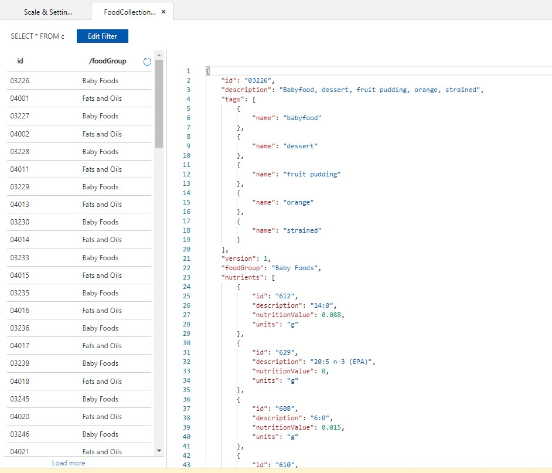
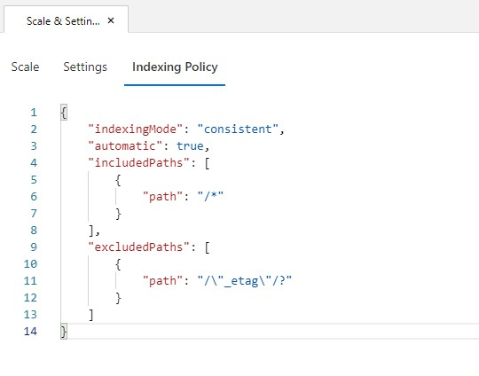
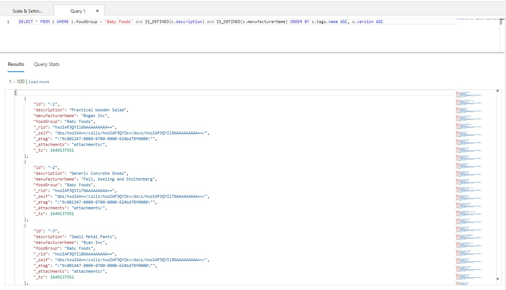
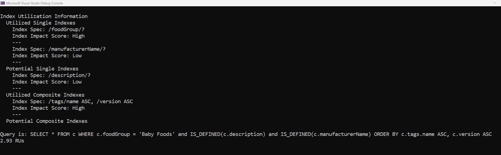

# Azure Cosmos DB - Query Indexing Metrics
How to do an Effective Study of Indexing Metrics for a Query in Azure Cosmos DB using .NET SDK

**Summary:**
This document provides guidance on getting your hands dirty using Azure Cosmos DB Core (SQL) API .NET SDK


# Contents

[Introduction](#Introduction)

[Points to Note](#points-to-note)

[How to Enable Indexing Metrics](#how-to-enable-indexing-metrics)

[An Example in .NET SDK](#an-example-in-net-sdk)

[Feedback](#feedback)

[License/Terms of Use](#license--terms-of-use)

## Introduction
Azure Cosmos DB Core (SQL) API provides **Indexing Metrics** to show both utilized indexed paths and recommended indexed paths. As an Azure Cosmos DB developer, you can leverage these Core (SQL) API indexing metrics to optimize query performance.

## Points to Note
3 important points to note:
1. Indexing Metrics is especially useful in cases where you are not sure how to modify the indexing policy for your specific use-case and Query Patterns.
2. Indexing Metrics is available for usage in Azure Cosmos DB .NET SDK and Java SDK, as of now.
3. Indexing Metrics require a minimum version: 1) If you're on .NET SDK, you need to ensure you're using .NET SDK ver 3.21.0 or later, 2) If you're on Java SDK, you need to ensure you're using 4.19.0 or later.

## How to Enable Indexing Metrics
You can enable indexing metrics for a query by setting the PopulateIndexMetrics property to true. When not specified, PopulateIndexMetrics defaults to false. 

## An Example in .NET SDK
I have an Azure Cosmos DB database named 'NutritionDatabase' and container named 'FoodCollection'.
You can see a sample schema of the items in the container.



The default Indexing Policy set at the container level is exhibited below.



I need to execute the following query:
```
SELECT * FROM c WHERE c.foodGroup = 'Baby Foods' and IS_DEFINED(c.description) and IS_DEFINED(c.manufacturerName) ORDER BY c.tags.name ASC, c.version ASC
```

Since I need to execute an ORDER BY query, we need to create a Composite Index directly in the Azure portal.
Hence, I go and change the Indexing Policy accordingly.

```
{
    "indexingMode": "consistent",
    "automatic": true,
    "includedPaths": [
        {
            "path": "/foodGroup/*"
        },
        {
            "path": "/manufacturerName/*"
        },
        {
            "path": "/tags/[]/name/*"
        },
        {
            "path": "/version/*"
        }
    ],
    "excludedPaths": [
        {
            "path": "/*"
        },
        {
            "path": "/\"_etag\"/?"
        }
    ],
    "compositeIndexes": [
        [
            {
                "path": "/tags/name",
                "order": "ascending"
            },
            {
                "path": "/version",
                "order": "ascending"
            }
        ]
    ]
}
```
From the Azure portal, we get an output similar to as exhibited below.


As a next step, we can leverage either the .NET or Java SDK to understand the both the utilized indexed paths and recommended indexed paths.

E.g., I am using the .NET SDK ver 3.26.1.
In the below code, you need to enable indexing metrics for a specific query by setting the **PopulateIndexMetrics** property to true.

```
    // In-partition Query: Complex
        string sqlQueryText = "SELECT * FROM c WHERE c.foodGroup = 'Baby Foods' and IS_DEFINED(c.description) and IS_DEFINED(c.manufacturerName) ORDER BY c.tags.name ASC, c.version ASC";
        QueryDefinition query = new QueryDefinition(sqlQueryText);
        FeedIterator<Food> resultSetIterator = container.GetItemQueryIterator<Food>(query, requestOptions: new QueryRequestOptions { PopulateIndexMetrics = true });
        FeedResponse<Food> response = null;
        while (resultSetIterator.HasMoreResults)
        {
            response = await resultSetIterator.ReadNextAsync();
            Console.WriteLine(response.IndexMetrics);
        }

        FeedResponse<Food> queryResponse3 = await resultSetIterator.ReadNextAsync();
        await Console.Out.WriteLineAsync($"Query is: {sqlQueryText}");
        await Console.Out.WriteLineAsync($"{response.RequestCharge} RUs");
        Console.Out.WriteLine();
```
Check the output as exhibited below.


The output is divided into 4 key sections:
1) Utilized Single Indexes
2) Potential Single Indexes
3) Utilized Composite Indexes
4) Potential Composite Indexes

The index **impact score** is the likelihood that an indexed path, based on the query shape, has a significant impact on query performance. In other words, the index impact score is the probability that, without that specific indexed path, the query RU charge would have been substantially higher. There are two possible index impact scores: high and low. If you have multiple potential indexed paths, we recommend focusing on indexed paths with a high impact score.

```
Index Spec: /foodGroup/?
Index Impact Score: High
```
means, /foodGroup which is the partitionKey for the container and part of the query, and indexing policy is important for the correct working of the query. In other words, the index impact score is the probability that, without that specific indexed path, the query RU charge would have been substantially higher.

```
Index Spec: /manufacturerName/?
Index Impact Score: Low
```
means, /manufacturerName though is part of the query, but has a low impact on the overall indexing both in terms of performance & query RU charge.

```
Index Spec: /description/?
Index Impact Score: Low
```
means, /description which is a potential Single Index, but has low impact on the overall scheme of things.
```
Index Spec: /tags/name ASC, /version ASC
Index Impact Score: High
```
means, /tags/name ASC, /version ASC which form our Utilized Composite Indexes are key for high performance and lowering overall RU cost.

By carefully analyzing your specific use-case query patterns and the Utilized and Potential Impact Scores, you can decide which Indexes are needed, or could be dropped without any major impact on your database Query Performance.

> **⚠ WARNING: Aliens are coming.**  
> No aliens are not coming, but since activating Indexing Metrics do incur an Overhead, the recommendation is not to activate it for every Production Query.
> You should only activate Indexing Metrics for queries which you feel are slow performing, and needs Optimization or Fine-Tuning.

For further study on Indexing in Azure Cosmos DB, here's some good links:
1. [Indexing policies in Azure Cosmos DB](https://docs.microsoft.com/en-us/azure/cosmos-db/index-policy)
2. [Manage indexing policies in Azure Cosmos DB](https://docs.microsoft.com/en-us/azure/cosmos-db/sql/how-to-manage-indexing-policy?tabs=dotnetv2%2Cpythonv3)
3. [Indexing metrics in Azure Cosmos DB](https://docs.microsoft.com/en-us/azure/cosmos-db/sql/index-metrics)
4. [Optimize query performance with Azure Cosmos DB indexing metrics](https://devblogs.microsoft.com/cosmosdb/query-performance-indexing-metrics/)

## Feedback
You can share any feedback at: sugh AT microsoft dot com

## License & Terms of Use

This is a free white paper released into the public domain.
Anyone is free to use or distribute this white paper, for any purpose, commercial or non-commercial, and by any means.

THE WHITE PAPER IS PROVIDED "AS IS", WITHOUT WARRANTY OF ANY KIND, EXPRESS OR IMPLIED, INCLUDING BUT NOT LIMITED TO THE WARRANTIES OF MERCHANTABILITY, FITNESS FOR A PARTICULAR PURPOSE AND NONINFRINGEMENT.

IN NO EVENT SHALL THE AUTHORS BE LIABLE FOR ANY CLAIM, DAMAGES OR OTHER LIABILITY, WHETHER IN AN ACTION OF CONTRACT, TORT OR OTHERWISE, ARISING FROM, OUT OF OR IN CONNECTION WITH THE WHITE PAPER.
